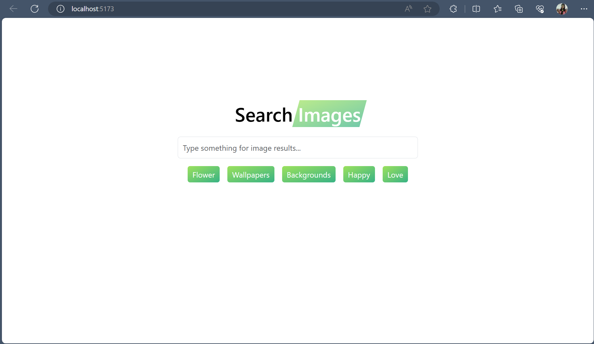

# React + Vite

### Search Images App using React + Vite

- Using Unsplash API for dynamic images search using tags and display.
- Using Axios library to send asynchronous HTTP requests.
- Using ESLint for analyzing code for potential errors, enforcing coding standards while improving code quality.
- Implementing Pagination in React

---

---

---

